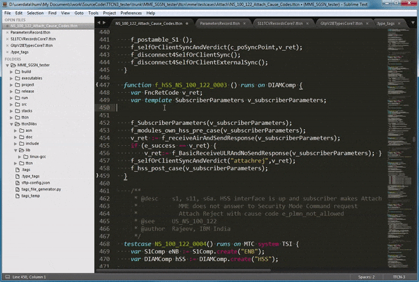

# Sublime TTCN-3 plugin

Sublime Text 3 plugin that offers auto-completion, TTCN-3 and ASN syntax highlight for TTCN-3



This plugin aims to provide easy-to-use, minimal-setup autocompletions for TTCN-3 for Sublime Text 3.

## Install this plugin ##
- Install from source code.
  + download one of the releases from
    [here](https://github.com/HuiMi24/TtcnComplete).
- Package Control
  + Package Control doesn't include this plugin yet.

## Settings auto completion trigger ##

Copy this to Setting User

`Preferences->Setting-User`

  ```json
	"auto_complete_triggers":
	[
		{
			"characters": ".",
			"selector": "source.ttcn3"
		}
	]
  ```
